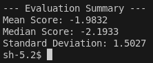

# SAPLMA

"""
1. Embeddings animals
2. Get results like in the paper - throw it to latex
3. Generate new sentence till it gets to ".". Then use Saplma with threshold 0.5 to determine if we can use it.
4. Use the reward model as well with midian threshold

"""